# 后端概要与详细设计说明书

本文基于 `server/` 目录的全部代码、现有文档（`README.md`、`API_DIFF.md`、`BACKEND_INTEGRATION.md`、`RequirementsAnalysis.md` 等）及架构图（`pic/`，核心流程图见 `pic/Gemini_Generated_Image_v0f943v0f943v0f9.png`）编写，覆盖论坛与即时通信后端的概要设计、详细设计与数据库设计。

## 1. 引言
- **目标**：指导开发/测试/运维理解后端架构、模块职责、关键流程与实现细节，为迭代与联调提供设计依据。
- **范围**：GateServer、StatusServer、ChatServer/ChatServer2、VarifyServer 及公共组件（common/、databaseD/）。
- **读者**：后端/前端工程师、测试、运维、架构师。
- **参考**：server 内全部代码与文档，数据库导出 `databaseD/*` 与架构图。

## 2. 系统总体设计（概要）
### 2.1 架构视图
- **整体形态**：前端仅对接 GateServer（HTTP/JSON），内部通过 gRPC 调度（验证码/节点分配/跨节点聊天）和 TCP 长连承载聊天数据平面，数据与缓存落地在 MySQL/Redis。
- **核心流程图**：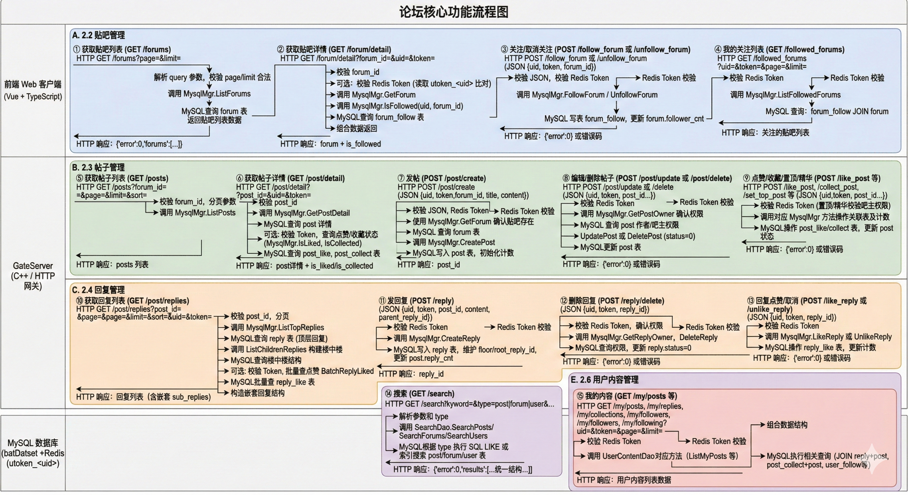
- **部署/端口**：GateServer:8080；VarifyServer gRPC:50051；StatusServer:50052；ChatServer TCP:8090/8091，gRPC:50055/50056；ChatServer 节点可按需水平扩展，通过配置加入 StatusServer 池。
- **数据流向**：
  - 写操作：前端 → GateServer → Redis 校验 token → MySQL 事务/计数 → 返回错误码。
  - 验证码/登录：GateServer → VarifyServer/StatusServer gRPC → Redis 写 `code_/utoken_` → 前端获得 token+节点。
  - 聊天：前端 TCP → ChatServer → Redis 校验 token → 本地/跨节点推送（gRPC）→ 终端。
- **控制/数据平面分离**：HTTP/gRPC 主要控制面，TCP 承载即时消息，便于独立扩缩与限流。

### 2.2 组件职责
- **GateServer（C++/Boost.Beast）**：唯一 HTTP 入口；承载论坛 CRUD、鉴权、验证码转发、登录、搜索、“我的”接口；调用 Redis/MySQL/gRPC。
- **StatusServer（C++/gRPC）**：维护 ChatServer 节点列表，分配聊天节点并生成 token，写 Redis 路由。
- **ChatServer/ChatServer2（C++/TCP+gRPC）**：聊天长连、好友/申请、消息转发、心跳；节点间 gRPC 互通。
- **VarifyServer（Node.js+gRPC）**：生成/发送邮件验证码，写入 Redis。
- **公共依赖**：MySQL（业务数据）、Redis（token/验证码/缓存/分布式锁）。
- **责任边界**：
  - GateServer 不存储长连状态；仅做 HTTP 聚合、鉴权和数据库读写。
  - StatusServer 只负责节点分配与 token 生命周期，不落业务数据。
  - ChatServer 维护在线态、好友/消息逻辑，不直接暴露 HTTP。

### 2.3 运行与配置
- 关键配置：`GateServer/config.ini`、`StatusServer/config.ini`、`ChatServer/config.ini`、`ChatServer2/config.ini`、`VarifyServer/config.json`；含端口、依赖地址、账号、SMTP。
- 依赖：CMake + Boost + gRPC + protobuf + MySQL Connector/C++，Redis，Node.js ≥16。
- 可用性基线：MySQL/Redis/VarifyServer/StatusServer/任一 ChatServer 必须可用；单个 ChatServer 故障可通过多节点冗余规避。
- 扩展/降级：GateServer/ChatServer 可横向扩容；验证码与聊天分区独立，可独立部署与重启。

### 2.4 关键业务流程
- **验证码获取**：前端 POST `/get_varifycode` → GateServer JSON 校验 → gRPC 调 VarifyServer 生成 4 位码 → Redis `code_<email>`（600s）→ 返回错误码；异常透传 `RPCFailed/VarifyExpired/VarifyCodeErr`。
- **注册**：前端 POST `/user_register`（email/user/passwd/confirm/icon/varifycode）→ GateServer 校验 JSON、两次密码、Redis 验证码 → MySQL 存储过程 `reg_user`（更新 `user_id`、插入 `user`，异常回滚）→ 返回 `uid/user/email`。
- **重置密码**：前端 POST `/reset_pwd` → GateServer 验证验证码 → 校验用户名与邮箱匹配（`MysqlMgr::CheckEmail`）→ 更新密码（`MysqlMgr::UpdatePwd`）→ 返回错误码。
- **登录与节点分配**：前端 POST `/user_login` → GateServer 校验邮箱/密码 → gRPC 调 StatusServer `GetChatServer` 分配节点 → Redis 写 `utoken_<uid>` → 返回 `{uid,token,host,port,servername}`；若 StatusServer 不可用返回 `RPCFailed`。
- **贴吧列表/详情**：GET `/forums`、`/forum/detail` → 校验分页/ID → DAO 读取 forum 与 follow 计数；若带 `uid/token` 返回 `is_followed`，token 校验失败返回 `TokenInvalid`。
- **关注/取关贴吧**：POST `/follow_forum`/`/unfollow_forum`（需 `uid/token/forum_id`）→ Redis 校验 token → DAO 写 `forum_follow` 与计数（去重检查 `AlreadyFollowed/NotFollowed`）。
- **帖子列表/排序**：GET `/posts`（`forum_id/page/limit/sort`）→ `PostDao::ListPosts` 按 `time|hot|reply` 排序、过滤 `status=1`，返回预览字段。
- **帖子详情/状态位**：GET `/post/detail`（`post_id` 可带 `uid/token`）→ 查询帖子+作者+贴吧名，过滤软删；如带 token，附 `is_liked/is_collected`。
- **发帖/编辑/删除**：POST `/post/create`、`/post/update`、`/post/delete`（需 `uid/token`）→ token 校验 → 事务插入/更新/软删 `status=0`，并同步 forum 计数；权限：作者或吧主可删。
- **帖子点赞/收藏/置顶/加精**：POST `/like_post`/`/unlike_post`/`/collect_post`/`/uncollect_post`/`/set_top_post`/`/set_essence_post`（需 `uid/token/post_id`）→ 校验是否存在/权限 → 更新计数与记录，去重校验 `AlreadyLiked/AlreadyCollected` 等。
- **回复列表与楼中楼**：GET `/post/replies`（`post_id/page/limit/sort`，可带 `uid/token`）→ `ReplyDao::ListTopReplies`+`ListChildReplies` 构建 `replies` + `sub_replies`，过滤软删，支持 `time|hot`。
- **回复增删与点赞**：POST `/reply`（`uid/token/post_id/content/parent_reply_id`）插入回复、更新计数、返 `reply_id`；`/reply/delete` 软删，权限=作者/帖主/吧主；`/like_reply`/`/unlike_reply` 更新计数，去重校验。
- **搜索**：GET `/search`（`keyword/type=post|forum|user/page/limit/(forum_id)`）→ 根据 type 走 `SearchDao`（LIKE 模糊，支持 forum_id 过滤帖子）→ 返回对应字段子集。
- **我的内容**：GET `/my/posts|/my/replies|/my/collections|/my/followers|/my/following`（需 `uid/token/page/limit`）→ 校验 token → 分页查询帖子/回复（含 `post_title`）/收藏/粉丝/关注列表。
- **聊天登录**：客户端持 `{uid,token,host,port}` 建立 TCP → 发送 `MSG_CHAT_LOGIN` → ChatServer 校验 Redis `utoken_<uid>`，写 `uip_<uid>`/`usession_<uid>`，如发现旧会话则发 `NotifyOffline` 踢下线 → 返回用户档案、好友列表、申请列表。
- **好友申请/审批**：`ID_ADD_FRIEND_REQ` 写 `friend_apply`，若对方在本节点直接推送 `NotifyAddFriend`，否则 gRPC 转发；`ID_AUTH_FRIEND_REQ` 同意后插入双向 `friend`，推送 `NotifyAuthFriend` 给申请方。
- **文本消息收发**：`ID_TEXT_CHAT_MSG_REQ`（含 `text_array`）→ 本节点在线直接推送 `NotifyTextChatMsg`，跨节点通过 gRPC；同时回 ACK `ID_TEXT_CHAT_MSG_RSP`，离线也返回成功，前端需结合在线状态。
- **心跳与会话清理**：客户端 10s 发送 `ID_HEART_BEAT_REQ`；服务端 >20s 未收到则清理 session 并可能踢下线；异地登录或服务端踢出会发 `ID_NOTIFY_OFF_LINE_REQ`。

## 3. 详细设计
### 3.1 目录与模块
```
server/
├─ GateServer/       # HTTP 网关
├─ StatusServer/     # 聊天节点分配 gRPC
├─ ChatServer/       # 聊天节点模板1
├─ ChatServer2/      # 聊天节点模板2
├─ VarifyServer/     # Node 验证码 gRPC
├─ common/           # BBS 公共 DAO
└─ databaseD/        # SQL/导出数据
```

### 3.2 GateServer 设计
- **入口/启动**：`GateServer.cpp` 读取 `config.ini`，初始化 `ConfigMgr`、`MysqlMgr`（连接池）、`RedisMgr`，构建 `LogicSystem`，注册 HTTP 路由，启动 `CServer` 监听 8080。连接由 `HttpConnection` 封装，使用 Boost.Beast 处理 request/response 与 query/body。
- **路由与业务调度**：`LogicSystem.cpp` 通过 `RegGet/RegPost` 注册路径到 lambda，覆盖验证码、注册、登录、论坛 CRUD、搜索、“我的”接口；统一使用 Json::Reader 解析，错误码来自 `const.h`；所有写操作先校验 token（`CheckTokenValid` 访问 Redis）。
- **鉴权与异常处理**：校验失败直接返回 `{error: TokenInvalid/UidInvalid}`；JSON 解析失败返回 `Error_Json`；gRPC 调用失败返回 `RPCFailed`，不抛异常中断。
- **DAO 层**：`MysqlMgr` 提供连接池（jdbc driver）；`MysqlDao` 汇集事务逻辑；具体表操作在 `ForumDao/PostDao/ReplyDao/SearchDao/UserContentDao`，全部使用预编译 SQL，软删过滤 `status=1`，帖子/回复计数更新在事务内。
- **缓存层**：`RedisMgr` 封装 redis-cpp 客户端，提供 KV Get/Set/Exists；验证码前缀 `code_`，token 前缀 `utoken_`。
- **外部调用**：`VerifyGrpcClient` 调 VarifyServer 获取验证码；`StatusGrpcClient` 调 StatusServer 分配 ChatServer 与 token；`ChatGrpcClient` 预留给内部聊天通知（当前论坛接口未使用）。
- **线程模型/资源**：`AsioIOServicePool` 管理多个 io_context 供 HTTP 处理；`CServer` 负责 accept，`HttpConnection` 负责生命周期与回调，确保高并发下非阻塞。
- **配置项**：`config.ini` 中 GateServer 端口、VarifyServer/StatusServer 地址、MySQL/Redis 连接信息；启动时必读。

### 3.3 StatusServer 设计
- **入口/启动**：`StatusServer.cpp` 加载 `config.ini`（服务端口、ChatServer 列表、MySQL/Redis），初始化 `MysqlMgr`、`RedisMgr`、`ConfigMgr`，启动 gRPC 服务监听 50052。
- **服务实现**：`StatusServiceImpl` 仅暴露 `GetChatServer`。选择策略可按配置轮询/随机，当前从节点列表中选择，返回 host/port/servername。
- **Token 生成与写入**：为登录用户生成随机 token（Boost UUID），写入 Redis `utoken_<uid>`，并回传 GateServer/前端；失败返回 `RPCFailed/UidInvalid`。
- **状态/路由存储**：可选写入 `uip_<uid>` 路由；负责维护 ChatServer 名称与地址映射（由 `ConfigMgr` 解析 `[chatservers]` 与子段）。
- **并发与锁**：使用 `AsioIOServicePool` 处理 gRPC；`DistLock` 防止同一 uid 高并发分配冲突。
- **故障处理**：若 Redis/MySQL/配置缺失或节点不可用，返回错误码并记录日志；不持久化业务表数据。

### 3.4 ChatServer/ChatServer2 设计
- **入口/启动**：`ChatServer.cpp` 读取 `config.ini`（Self/Peer 节点、TCP 端口、gRPC 端口、MySQL/Redis），初始化 `MysqlMgr`、`RedisMgr`、`ConfigMgr`、`AsioIOServicePool`，启动 TCP 监听与 gRPC 服务。
- **连接与协议**：`CServer` 监听 TCP（8090/8091）；`CSession` 代表单连接，按 2B 消息 ID + 2B 长度 + JSON 解帧，封装发送/接收队列，维护心跳时间。
- **消息分发**：`LogicSystem` 注册 handler（登录、搜索用户、加好友、审批、文本消息、心跳）；消息 ID 定义见 `const.h`/`LogicSystem.cpp`。收到消息后校验字段 → 调用 DAO/Redis → 生成响应与推送。
- **gRPC 服务与客户端**：`ChatServiceImpl` 提供跨节点通知（AddFriend/AuthFriend/TextChat/Offline）；`ChatGrpcClient` 用于调用其他 ChatServer；`BbsServiceImpl` 预留。
- **业务流程**：
  - 登录：校验 Redis token 与 uid 一致；写 `uip_<uid>`（路由）与 `usession_<uid>`（会话 ID）；如有旧 session，通过 gRPC/本地推送 `NotifyOffline`。
  - 好友/申请：DAO 访问 MySQL（`friend_apply`/`friend`），成功后尝试本地 session 推送，不在本节点则 gRPC 转发。
  - 文本消息：入参包含 `text_array`，本节点在线则直接 `NotifyTextChatMsg`；不在线或在其他节点则 gRPC 转发；无论对方在线与否都会回 ACK。
  - 心跳：`ID_HEART_BEAT_REQ` 更新 session 时间；定时任务清理 >20s 未心跳的会话。
- **存储与缓存**：`MysqlDao` 处理好友表/申请表等；`RedisMgr` 负责 token 校验、路由、分布式锁；`DistLock` 防并发登录/清理。
- **扩展/容错**：节点列表来自配置 `[PeerServer]`；新节点加入需更新配置并重启；跨节点失败不影响本节点 ACK，但会记录日志。

### 3.5 VarifyServer 设计
- **入口/启动**：`server.js` 读取 `config.json`（SMTP、Redis、gRPC 端口），创建 gRPC 服务监听 50051。
- **职责**：接受 `GetVarifyCode(email)` 请求 → 生成 4 位验证码（`const.js` 可配置）→ `redis.js` 写入 `code_<email>`（TTL 600s）→ `email.js` 通过 SMTP 发送邮件 → 返回 `{error,email}`。
- **依赖与容错**：Redis 不可用/超时报错返回 `VarifyExpired`；SMTP 失败返回 `RPCFailed`；日志输出到 stdout。
- **协议**：消息结构在 `message.proto`/`proto.js`，与 GateServer 的 `VerifyGrpcClient` 对应。

### 3.6 公共 DAO（common/bbs）
- **封装原则**：每个 DAO 只负责单一表/聚合查询；使用 `MySqlPool` 连接池；`Defer` 归还连接；所有写操作使用预编译语句和必要事务。
- **ForumDao**：查询贴吧列表/详情，更新关注/帖子计数，校验贴吧存在；关联 `forum_admin` 支持吧主权限。
- **PostDao**：帖子列表/详情，支持排序 `time|hot|reply`，过滤软删；创建/更新/软删帖子的事务；点赞/收藏/置顶/加精更新计数并去重校验；获取帖子所有者用于权限判断。
- **ReplyDao**：楼中楼查询（顶层+子回复），按 `time|hot` 排序；创建回复时写 floor/root_reply_id，更新帖子/回复计数；软删回复；点赞/取消点赞。
- **SearchDao**：根据 type=post|forum|user 分别模糊查询标题/描述/用户名或邮箱，支持 forum_id 过滤帖子。
- **UserContentDao**：我的帖子/回复/收藏/粉丝/关注，JOIN 用户与帖子获取必要展示字段（如 `post_title`）。
- **事务策略**：发帖/删帖/回复/计数更新统一放在 DAO 内部事务，异常回滚。

### 3.7 配置/运行时
- **配置文件**：`config.ini`（C++ 服务）、`config.json`（Node）；包含服务端口、MySQL/Redis 地址账号、ChatServer 节点列表、SMTP。
- **运行路径与依赖**：构建时写入 RPATH 指向 OpenSSL/MySQL Connector；若路径变更需在 CMake 传入 `CMAKE_PREFIX_PATH/MYSQLCPPCONN_ROOT`。
- **初始化顺序**：读取配置 → 初始化日志/连接池/线程池 → 注册路由或 gRPC/TCP 服务 → 启动监听。
- **环境假设**：UTF-8 源码与日志；Redis/MySQL 需可访问且权限正确；Node.js 版本满足 VarifyServer 依赖。

## 4. 接口与协议设计
### 4.1 HTTP（GateServer）
- **风格**：HTTP/1.1 + JSON，统一 `error` 字段；更新/删除多用 POST，路径参数以 query 方式实现；`Content-Type: application/json`。
- **鉴权**：所有写操作及“我的*”需 `uid+token`；Redis 校验 `utoken_<uid>`，失败返回 `TokenInvalid/UidInvalid`。
- **账户/安全**：  
  - `POST /get_varifycode` `{email}` → `{error,email}`  
  - `POST /user_register` `{email,user,passwd,confirm,icon,varifycode}` → `{error,uid,user,email}`  
  - `POST /reset_pwd` `{email,user,passwd,varifycode}` → `{error}`  
  - `POST /user_login` `{email,passwd}` → `{error,uid,token,host,port,email}`
- **贴吧**：  
  - `GET /forums?page&limit` → `{error,forums:[...follower_count,post_count...]}`  
  - `GET /forum/detail?forum_id[&uid&token]` → `{error,forum:{...,is_followed}}`  
  - `POST /follow_forum` / `/unfollow_forum` `{uid,token,forum_id}` → `{error}`  
  - `GET /followed_forums?uid&token&page&limit` → `{error,forums:[...]}`
- **帖子**：  
  - `GET /posts?forum_id&page&limit&sort` (`time|hot|reply`) → `{error,posts:[...content_preview...]}`  
  - `GET /post/detail?post_id[&uid&token]` → `{error,post:{...,is_liked,is_collected}}`  
  - `POST /post/create` `{uid,token,forum_id,title,content}` → `{error,post_id}`  
  - `POST /post/update` `{uid,token,post_id,title,content}` → `{error}`  
  - `POST /post/delete` `{uid,token,post_id}` → `{error}` (软删)  
  - `POST /like_post` / `/unlike_post` `{uid,token,post_id}` → `{error}`  
  - `POST /collect_post` / `/uncollect_post` `{uid,token,post_id}` → `{error}`  
  - `POST /set_top_post` `{uid,token,post_id,is_top}` / `/set_essence_post` `{uid,token,post_id,is_essence}` → `{error}`
- **回复**：  
  - `GET /post/replies?post_id&page&limit&sort[&uid&token]` → `{error,replies:[{...,sub_replies:[...] }]}`  
  - `POST /reply` `{uid,token,post_id,content,parent_reply_id}` → `{error,reply_id}`  
  - `POST /reply/delete` `{uid,token,reply_id}` → `{error}` (软删)  
  - `POST /like_reply` / `/unlike_reply` `{uid,token,reply_id}` → `{error}`
- **搜索**：`GET /search?keyword&type=post|forum|user&forum_id&page&limit` → `{error,results:[...]}`（字段随 type 变化）。
- **我的**：  
  - `GET /my/posts|/my/replies|/my/collections?uid&token&page&limit` → 对应列表（回复含 `post_title`）  
  - `GET /my/followers|/my/following?uid&token&page&limit` → `{error,users:[...]}`
- **约定**：所有接口返回 `error`，成功为 0；软删数据不在列表与详情出现；JSON 解析失败返回 `Error_Json`。

### 4.2 gRPC
- **协议文件**：`server/*/message.proto`（各服务拷贝一致）。  
- **VarifyService**（VarifyServer）：`GetVarifyCode(GetVarifyReq{email}) → GetVarifyRsp{error,email,code}`；由 GateServer 调用。
- **StatusService**（StatusServer）：  
  - `GetChatServer(GetChatServerReq{uid}) → GetChatServerRsp{error,host,port,token}`（必写 Redis `utoken_<uid>`）  
  - `Login(LoginReq{uid,token}) → LoginRsp{error,uid,token}`（预留，当前主要用 GetChatServer）
- **ChatService**（ChatServer 间互调）：  
  - `NotifyAddFriend(AddFriendReq{applyuid,name,desc,icon,nick,sex,touid}) → AddFriendRsp{error,applyuid,touid}`  
  - `RplyAddFriend(RplyFriendReq{rplyuid,agree,touid}) → RplyFriendRsp{error,...}`  
  - `NotifyAuthFriend(AuthFriendReq{fromuid,touid}) → AuthFriendRsp{error,...}`  
  - `NotifyTextChatMsg(TextChatMsgReq{fromuid,touid,textmsgs[msgid,msgcontent]}) → TextChatMsgRsp{error,...}`  
  - `SendChatMsg(SendChatMsgReq{fromuid,touid,message}) → SendChatMsgRsp{error,...}`（文本消息老版本接口）  
  - `NotifyKickUser(KickUserReq{uid}) → KickUserRsp{error,uid}`
- **BbsService**：在 ChatServer 中预留 `BbsServiceImpl`（当前未暴露额外方法，保持 proto 同步）。
- **错误透传**：gRPC 返回的 `error` 与 GateServer/ChatServer 错误码一致；RPC 失败由调用侧包装 `RPCFailed`。

### 4.3 TCP 消息（ChatServer）
- **封包格式**：2 字节消息 ID (big-endian) + 2 字节正文长度 + JSON 正文；最大 2 KB。
- **消息 ID 与含义**（见 `ChatServer/const.h`）：  
  - 1005 `MSG_CHAT_LOGIN` / 1006 `MSG_CHAT_LOGIN_RSP`：登录/响应，携带 `uid/token`，返回档案、好友、申请列表。  
  - 1007 `ID_SEARCH_USER_REQ` / 1008 `ID_SEARCH_USER_RSP`：按 uid 或用户名搜索。  
  - 1009 `ID_ADD_FRIEND_REQ` / 1010 `ID_ADD_FRIEND_RSP`：发起好友申请。  
  - 1011 `ID_NOTIFY_ADD_FRIEND_REQ`：被申请方实时通知。  
  - 1013 `ID_AUTH_FRIEND_REQ` / 1014 `ID_AUTH_FRIEND_RSP`：审批好友；  
  - 1015 `ID_NOTIFY_AUTH_FRIEND_REQ`：申请方收到审批结果。  
  - 1017 `ID_TEXT_CHAT_MSG_REQ` / 1018 `ID_TEXT_CHAT_MSG_RSP`：文本消息请求/ACK，含 `text_array`。  
  - 1019 `ID_NOTIFY_TEXT_CHAT_MSG_REQ`：文本消息推送给接收方。  
  - 1021 `ID_NOTIFY_OFF_LINE_REQ`：异地登录/踢下线通知。  
  - 1023 `ID_HEART_BEAT_REQ` / 1024 `ID_HEARTBEAT_RSP`：心跳。
- **链路约定**：客户端登录成功后每 ~10s 发送心跳；>20s 未心跳服务端清理并可下发下线通知；消息体均为 UTF-8 JSON。

## 5. 数据库设计
### 5.1 逻辑模型（论坛 + 社交）
- 用户：`user(uid,name,email,pwd,nick,desc,sex,icon)`；`user_id` 自增表 + `reg_user` 存储过程生成 uid。
- 贴吧：`forum(forum_id,name,avatar,description,owner_uid,follower_cnt,post_cnt,created_at,updated_at)`；`forum_admin(forum_id,uid,role)`。
- 关注：`forum_follow(forum_id,uid,created_at)`；用户关注 `user_follow(uid,target_uid,created_at)`。
- 帖子：`post(post_id,forum_id,uid,title,content,is_top,is_essence,like_cnt,collect_cnt,reply_cnt,status,created_at,updated_at,last_reply_at)`。
- 点赞/收藏：`post_like(post_id,uid,created_at)`、`post_collect(post_id,uid,created_at)`；回复点赞 `reply_like(reply_id,uid,created_at)`。
- 回复：`reply(reply_id,post_id,uid,content,parent_reply_id,root_reply_id,floor,like_cnt,status,created_at)`。
- 社交：`friend(self_id,friend_id,back)`，`friend_apply(from_uid,to_uid,status)`。
- **软删**：帖子/回复使用 `status` 过滤（1=有效，0=删除）。

### 5.2 约束与索引
- 唯一：`user.email`、`user.uid`、`forum_admin(forum_id,uid)`、`forum_follow(forum_id,uid)`、`post_like(post_id,uid)`、`post_collect(post_id,uid)`、`reply_like(reply_id,uid)`、`friend(self_id,friend_id)`、`friend_apply(from_uid,to_uid)`。
- 索引：`user.name`、`post.forum_id`、`reply.post_id`；可根据实际加全文索引以优化搜索。

### 5.3 事务与计数
- 发帖/删帖/回复/点赞/收藏/关注均在 DAO 内处理计数更新（forum/post 计数）并使用事务保证一致性，异常回滚。

### 5.4 Redis 设计
- Token：`utoken_<uid>`；路由：`uip_<uid>`；会话：`usession_<uid>`。
- 验证码：`code_<email>`（600s）。
- 用户缓存：`ubaseinfo_<uid>`、`nameinfo_<name>`；在线统计：`logincount`（Hash）。
- 分布式锁：`lock_<uid>`、`lockcount`。

### 5.5 表级详细设计
- **user**（用户基础表）  
  - 字段：`id` PK 自增；`uid` 唯一业务 ID；`name`（索引）；`email` 唯一；`pwd`；`nick`；`desc`；`sex` int；`icon`。  
  - 约束：UNIQUE(`uid`), UNIQUE(`email`), INDEX(`name`)；字符集 utf8mb4_unicode_ci。  
- **user_id**（uid 序列表）  
  - 字段：`id` PK；存储当前 uid 序列。  
  - 用途：存储过程 `reg_user` 递增后生成新 uid。  
- **forum**（贴吧）  
  - 字段：`forum_id` PK；`name`；`avatar`；`description`；`owner_uid`；`follower_cnt`；`post_cnt`；时间戳 `created_at/updated_at`。  
  - 用途：列表/详情/权限（owner/吧主）；计数用于排序展示。  
- **forum_admin**（贴吧管理员/吧主）  
  - 字段：`id` PK；`forum_id`；`uid`；`role`（1=owner/吧主）。  
  - 约束：UNIQUE(`forum_id`,`uid`)。  
  - 用途：置顶/加精/删帖权限校验。  
- **forum_follow**（贴吧关注关系）  
  - 字段：`id` PK；`forum_id`；`uid`；`created_at`。  
  - 约束：UNIQUE(`forum_id`,`uid`)。  
  - 用途：关注/取消关注、关注列表、计数更新。  
- **post**（帖子）  
  - 字段：`post_id` PK；`forum_id`；`uid`；`title`；`content`；`is_top`；`is_essence`；`like_cnt`；`collect_cnt`；`reply_cnt`；`status`（软删）；`created_at`；`updated_at`；`last_reply_at`。  
  - 约束：INDEX(`forum_id`)；业务层过滤 `status=1`。  
  - 用途：列表/详情/权限/计数/排序。  
- **post_like**（帖子点赞）  
  - 字段：`id` PK；`post_id`；`uid`；`created_at`。  
  - 约束：UNIQUE(`post_id`,`uid`)。  
  - 用途：点赞/取消点赞、计数。  
- **post_collect**（帖子收藏）  
  - 字段：`id` PK；`post_id`；`uid`；`created_at`。  
  - 约束：UNIQUE(`post_id`,`uid`)。  
  - 用途：收藏/取消收藏、计数。  
- **reply**（回复/楼中楼）  
  - 字段：`reply_id` PK；`post_id`；`uid`；`content`；`parent_reply_id`；`root_reply_id`；`floor`；`like_cnt`；`status`（软删）；`created_at`。  
  - 约束：INDEX(`post_id`)；楼层/父子结构由业务维护。  
  - 用途：回复列表/楼中楼、计数、权限。  
- **reply_like**（回复点赞）  
  - 字段：`id` PK；`reply_id`；`uid`；`created_at`。  
  - 约束：UNIQUE(`reply_id`,`uid`)。  
  - 用途：回复点赞/取消点赞、计数。  
- **user_follow**（用户关注/粉丝）  
  - 字段：`id` PK；`uid`；`target_uid`；`created_at`。  
  - 约束：UNIQUE(`uid`,`target_uid`)。  
  - 用途：我的关注/粉丝；可用于社交扩展。  
- **friend**（聊天好友关系）  
  - 字段：`id` PK；`self_id`；`friend_id`；`back`（备注）。  
  - 约束：UNIQUE(`self_id`,`friend_id`)。  
  - 用途：聊天好友列表；备注存储在 `back`。  
- **friend_apply**（好友申请）  
  - 字段：`id` PK；`from_uid`；`to_uid`；`status`（0 待处理，1 同意）。  
  - 约束：UNIQUE(`from_uid`,`to_uid`)。  
  - 用途：好友申请/审批流程，推送通知。  
- **存储过程 `reg_user`**  
  - 输入：`new_name`、`new_email`、`new_pwd`；输出 `result`。  
  - 逻辑：检查用户名/邮箱唯一 → 自增 `user_id` → 插入 `user` → 成功返回新 uid，已存在返回 0，异常回滚返回 -1。

## 6. 模块级详细设计
### 6.1 GateServer 主要类/文件（含核心方法）
- `GateServer.cpp`：入口，读取 `config.ini` → 初始化单例 `ConfigMgr::Inst()`、`MysqlMgr::GetInstance()`、`RedisMgr::GetInstance()` → 构造 `LogicSystem` → `CServer` 监听 8080，线程池由 `AsioIOServicePool` 提供。
- `CServer`（GateServer/CServer.{h,cpp}）：封装 accept/启动，内部持有 `AsioIOServicePool _io_service_pool`，每个连接生成 `HttpConnection` 并绑定 `LogicSystem` 回调。
- `AsioIOServicePool`：`run()` 启动若干工作线程；`get_io_service()` 轮询返回 io_context；用于 HTTP 读写与 gRPC 客户端异步。
- `HttpConnection`：在 `do_read()` 中使用 Beast 解析请求；`_get_params` 保存 query；`_request.body()` 传递给 `LogicSystem`；`_response` 由 handler 填充后 async write。
- `LogicSystem`（构造函数内 `RegGet/RegPost` 注册路由）：  
  - 账户相关：`/get_varifycode` 调 `VerifyGrpcClient::GetVarifyCode`；`/user_register` 校验密码/验证码 → `MysqlMgr::RegUser`；`/reset_pwd` 校验验证码 → `MysqlMgr::UpdatePwd`；`/user_login` 校验密码 → `StatusGrpcClient::GetChatServer`。  
  - 贴吧：`/forums` → `ForumDao::ListForums`；`/forum/detail` → `ForumDao::GetForum`; 关注/取关 → `ForumDao::Follow/Unfollow` + Redis token 校验；`/followed_forums` → `ForumDao::ListFollowedForums`。  
  - 帖子：`/posts` → `PostDao::ListPosts`（排序 normalize）；`/post/detail` → `PostDao::GetPostDetail` + like/collect 状态；创建/更新/删除 → `PostDao::CreatePost/UpdatePost/DeletePost`（事务，软删）；点赞/收藏/置顶/加精 → 对应 DAO 方法（幂等校验）。  
  - 回复：`/post/replies` → `ReplyDao::ListTopReplies` + `ListChildReplies` 组装楼中楼；`/reply` → `ReplyDao::CreateReply`（写 floor/root，回填 reply_id）；`/reply/delete` 软删；`/like_reply`/`/unlike_reply` → `ReplyDao::Like/Unlike`.  
  - 搜索/我的：`/search` → `SearchDao::SearchPosts/Forums/Users`；`/my/*` → `UserContentDao::ListMyPosts/ListMyReplies/ListMyCollections/ListMyFollowers/ListMyFollowing`。  
  - 共通：`CheckTokenValid`（静态）读取 Redis `utoken_<uid>`；解析失败返回 `Error_Json`；所有响应统一 `error` 字段。
- `RedisMgr`：`Get/Set/Exists`、分布式锁辅助；键前缀 `CODEPREFIX/USERTOKENPREFIX`。
- `MysqlMgr`：封装 JDBC 连接池；提供高阶方法 `RegUser`（调用存储过程 `reg_user`）、`CheckPwd`、`CheckEmail`、`UpdatePwd` 等；底层连接获取/归还是 `MysqlDao`。
- `ForumDao/PostDao/ReplyDao/SearchDao/UserContentDao`（common/bbs）：各自提供 List/Detail/Create/Update/Delete、计数更新与权限校验；全部使用预编译 SQL，发帖/删帖/回复使用事务保证计数一致。
- gRPC 客户端：  
  - `VerifyGrpcClient`：封装 `GetVarifyCode` 调用，失败映射 `RPCFailed`。  
  - `StatusGrpcClient`：封装 `GetChatServer`，解析返回 host/port/token；连接失败返回 `RPCFailed`。  
  - `ChatGrpcClient`：预留聊天通知调用。
- 常量与工具：`const.h`（错误码、前缀、Defer RAII）；`Defer` 用于自动提交/归还资源。

### 6.2 StatusServer（类与方法）
- `StatusServer.cpp`：读取 `config.ini`（含 `[chatservers]` 列表、DB/Redis 配置），初始化 `ConfigMgr`、`RedisMgr`、`MysqlMgr`、`AsioIOServicePool`，启动 gRPC。
- `StatusServiceImpl`：  
  - `GetChatServer`：生成 UUID token，调用 `RedisMgr::Set(utoken_<uid>, token)`；通过 `ConfigMgr` 读取 ChatServer 名称/地址（`[chatserver1]...`），选择节点返回 host/port/token/服务器名。  
  - `Login`（预留）：校验 Redis token 与 uid。  
  - 异常捕获后返回 `RPCFailed`，并写日志。
- `ConfigMgr`：封装 INI 读取，提供 `operator[]` 访问段/键，用于节点配置和数据库/Redis 参数。
- `RedisMgr`：与 GateServer 同步实现，负责 token 写入与读取。
- `MysqlMgr`/`MysqlDao`：供校验扩展使用（当前主要依赖 Redis）。
- `ChatGrpcClient`：可调用 ChatServer 的 `NotifyKickUser` 等（踢掉旧连接）。
- `DistLock`：Redis 锁，用于序列化分配或路由写操作（超时由 `LOCK_TIME_OUT/ACQUIRE_TIME_OUT` 控制）。
- `AsioIOServicePool`：为 gRPC 提供线程池。

### 6.3 ChatServer*（类与方法）
- `ChatServer.cpp`：加载配置（Self/Peer、TCP/gRPC、DB/Redis），初始化 `ConfigMgr`、`MysqlMgr`、`RedisMgr`、`AsioIOServicePool`；启动 `CServer`(TCP) 与 gRPC 服务（`ChatServiceImpl`，`BbsServiceImpl`）。
- TCP 层：  
  - `CServer`：监听 8090/8091；接受连接并创建 `CSession`；维护 `_session_map` 以便按 session_id 管理。  
  - `CSession`：保存 socket、session_id、uid；`Start()` 开始读循环；`Send(std::string,id)` 发送帧（2B id + 2B 长度 + JSON）；`NotifyOffline` 发送下线通知并关闭；记录心跳时间。  
  - `MsgNode`：队列节点，包含待处理消息和 session。
- 消息分发核心 `LogicSystem`：  
  - `RegisterCallBacks` 将 `MSG_CHAT_LOGIN/ID_SEARCH_USER_REQ/ID_ADD_FRIEND_REQ/ID_AUTH_FRIEND_REQ/ID_TEXT_CHAT_MSG_REQ/ID_HEART_BEAT_REQ` 绑定到对应 handler。  
  - `LoginHandler`：解析 `uid/token` → Redis 校验 `utoken_<uid>` → 加载用户档案 `GetBaseInfo`（优先 Redis 缓存，落库）→ 获取好友申请列表 `GetFriendApplyInfo`、好友列表 `GetFriendList` → 分布式锁 `acquireLock(lock_key)` 互斥登录 → 若已有 session，则本节点调用 `NotifyOffline` 或 gRPC `NotifyKickUser` 踢旧连接 → 更新 Redis `uip_<uid>`、`usession_<uid>`，`UserMgr::SetUserSession` 绑定 session。  
  - `SearchInfo`：判断 `uid` 是否纯数字，调用 `GetUserByUid` 或 `GetUserByName`（查 Redis 缓存或 DB），返回用户档案。  
  - `AddFriendApply`：写 MySQL `MysqlMgr::AddFriendApply(uid,touid)`；查 `uip_<touid>`，同节点则直接 `session->Send(ID_NOTIFY_ADD_FRIEND_REQ)`，跨节点构造 `AddFriendReq` 走 gRPC `NotifyAddFriend`。  
  - `AuthFriendApply`：`MysqlMgr::AuthFriendApply` 更新申请；`AddFriend` 双向插入；查 `uip_<touid>`，同节点推送 `ID_NOTIFY_AUTH_FRIEND_REQ`，否则 gRPC `NotifyAuthFriend`。  
  - `DealChatTextMsg`：ACK `ID_TEXT_CHAT_MSG_RSP` 回传 `text_array`；查 `uip_<touid>`，同节点直接推送 `ID_NOTIFY_TEXT_CHAT_MSG_REQ`，跨节点构造 `TextChatMsgReq` 由 `ChatGrpcClient::NotifyTextChatMsg` 转发。  
  - `HeartBeatHandler`：回 `ID_HEARTBEAT_RSP`，供会话保活；定时器在 `CServer` 清理超时 session。  
  - 工具：`isPureDigit`、`GetUserByUid/GetUserByName`、`GetBaseInfo` 等辅助 Redis+MySQL 查询。
- gRPC 层：  
  - `ChatServiceImpl`：实现 `NotifyAddFriend`/`RplyAddFriend`/`NotifyAuthFriend`/`NotifyTextChatMsg`/`SendChatMsg`/`NotifyKickUser`，在目标节点内查找 session 并发送对应 TCP 消息。  
  - `ChatGrpcClient`：封装向其他 ChatServer 的上述调用。  
  - `BbsServiceImpl`：预留扩展占位（当前未使用）。  
- 存储与缓存：  
  - `MysqlMgr` 提供好友/申请查询与写入；`MysqlDao` 为连接池。  
  - `RedisMgr`：token 校验、路由、会话、锁；键前缀 `USERTOKENPREFIX/USERIPPREFIX/USER_SESSION_PREFIX` 等。  
  - `UserMgr`：管理 uid→session 映射，便于实时推送与踢人。  
  - `DistLock`：确保同一 uid 登录互斥（`acquireLock/releaseLock`）。  
  - `ConfigMgr`：读取自节点与 peers 配置。

### 6.4 VarifyServer（类/文件与实现）
- `server.js`：使用 gRPC 绑定 `VarifyService.GetVarifyCode`；读取 `config.json`（包含 Redis/SMTP/端口）；启动服务监听 50051。
- `proto.js`：从 `message.proto` 生成的 gRPC stub，导出 `VarifyService`.
- `email.js`：通过 SMTP 发送验证码邮件；捕获发送异常并返回错误。
- `redis.js`：封装 Redis 客户端，`setCode/getCode` 对键 `code_<email>` 读写，TTL 600s。
- `const.js`：验证码长度等常量。
- 处理流程：接收 `GetVarifyCode` → 生成 4 位验证码 → `redis.js.setCode` 写入 → `email.js` 发送 → 返回 `{error,email}`；Redis/邮件异常映射到 `VarifyExpired/RPCFailed`，日志输出到 stdout。

## 7. 关键实现与流程细节（含源码定位）
- **验证码获取（GateServer → VarifyServer）**：`GateServer/LogicSystem.cpp` 中 `/get_varifycode` handler 解析 JSON → 校验 `email` → `VerifyGrpcClient::GetVarifyCode`（调用 VarifyService.GetVarifyCode，见 `VarifyServer/proto.js` 与 `server/ChatServer/message.proto`）→ Redis 写 `code_<email>`，失败返回 `RPCFailed/VarifyExpired/VarifyCodeErr`。VarifyServer 侧 `server.js` 生成 4 位码（`const.js`）→ `redis.js.setCode` → `email.js` 发送。
- **注册流程**：`/user_register`（`GateServer/LogicSystem.cpp`）校验 `passwd==confirm`、Redis 验证码 → `MysqlMgr::RegUser` 触发存储过程 `reg_user`（`databaseD/llfc.sql`）自增 `user_id` 并插入 `user`，返回 uid；失败返回 `UserExist`；结果统一 JSON 响应。
- **重置密码**：`/reset_pwd` 校验验证码（Redis `code_<email>`）→ `MysqlMgr::CheckEmail` 验证用户名/邮箱匹配 → `MysqlMgr::UpdatePwd` 更新密码；错误映射 `EmailNotMatch/VarifyExpired/VarifyCodeErr/PasswdUpFailed`。
- **登录与节点分配**：`/user_login` 校验邮箱+密码（`MysqlMgr::CheckPwd`，预编译 SQL）→ `StatusGrpcClient::GetChatServer` gRPC 返回 host/port/token → Redis 写 `utoken_<uid>`；响应中带聊天节点与 token（由 StatusServiceImpl 生成 UUID，`StatusServer/StatusServiceImpl.cpp`）。
- **贴吧列表/详情**：`/forums` → `ForumDao::ListForums`（预编译 SQL，分页）；`/forum/detail` → `ForumDao::GetForum`，若传 `uid/token` 则 `CheckTokenValid` 后附加 `is_followed`（查 `forum_follow`）。
- **关注/取关贴吧**：`/follow_forum` `/unfollow_forum` 需 `uid/token`，`ForumDao::Follow/Unfollow` 写 `forum_follow` 表并更新 `forum.follower_cnt`，已关注返回 `AlreadyFollowed/NotFollowed`。
- **帖子列表/排序**：`/posts` 调 `PostDao::ListPosts`（`GateServer/PostDao.cpp`，NormalizeSort 支持 time/hot/reply；SQL 计算 `(reply_cnt*2+like_cnt)` 作为 hot，过滤 `status=1`，截取内容预览）。
- **帖子详情**：`/post/detail` 调 `PostDao::GetPostDetail`（JOIN user/forum，过滤软删）；若带 token，附加 `is_liked/is_collected`（查 like/collect 表）。
- **发帖/编辑/删除**：`/post/create` → `PostDao::CreatePost` 事务插入 post、回填 `post_id`、更新 `forum.post_cnt`；`/post/update` 更新标题/内容（权限=作者或吧主）；`/post/delete` 软删 `status=0` 并减计数，均需 `uid/token`。
- **帖子点赞/收藏/置顶/加精**：`/like_post`/`/unlike_post`/`/collect_post`/`/uncollect_post` 调 `PostDao` 去重校验并更新计数；`/set_top_post`/`/set_essence_post` 校验贴吧 owner 权限（`forum_admin.role=1`），更新布尔标记。
- **回复列表与楼中楼**：`/post/replies` 调 `ReplyDao::ListTopReplies` + `ListChildReplies` 组装 `sub_replies`（按 `parent_reply_id/root_reply_id`）；支持 `sort=time|hot`，过滤软删。
- **回复发布/删除/点赞**：`/reply` → `ReplyDao::CreateReply`（写 `floor`、`root_reply_id`，更新帖子 `reply_cnt`）；`/reply/delete` 软删，权限=作者/帖主/吧主；`/like_reply`/`/unlike_reply` 更新计数，去重校验 `AlreadyLikedReply/NotLikedReply`。
- **搜索**：`/search` 调 `SearchDao::SearchPosts/Forums/Users`（LIKE 模糊；可按 `forum_id` 过滤帖子）；结果字段按 type 裁剪。
- **我的内容**：`/my/posts|replies|collections`、`/my/followers|following` 调 `UserContentDao`，JOIN 用户/帖子获取展示字段（回复含 `post_title`）；均需 `uid/token`。
- **聊天登录（TCP）**：`ChatServer/LogicSystem.cpp::LoginHandler` 解析 `uid/token` → Redis 校验 `utoken_<uid>` → 加载用户档案 `GetBaseInfo`（优先 Redis `ubaseinfo_<uid>`，未命中查 DB）→ 加载申请列表 `GetFriendApplyInfo`、好友列表 `GetFriendList` → 分布式锁 `lock_<uid>` 避免并发登录 → 若已登录：同节点调用 `CSession::NotifyOffline` 并 `CServer::ClearSession`；跨节点通过 gRPC `NotifyKickUser` → 更新 Redis `uip_<uid>`/`usession_<uid>`，`UserMgr::SetUserSession` 绑定 session → 返回 `MSG_CHAT_LOGIN_RSP`。
- **搜索用户（聊天）**：`LogicSystem::SearchInfo` 判断 uid 是否纯数字（`isPureDigit`），调用 `GetUserByUid/GetUserByName`（优先 Redis `nameinfo_<name>`，否则 DB），返回档案通过 `ID_SEARCH_USER_RSP`。
- **好友申请**：`LogicSystem::AddFriendApply` 写 MySQL（`MysqlMgr::AddFriendApply`）→ 查 Redis `uip_<touid>`；同节点直接通过 `session->Send(ID_NOTIFY_ADD_FRIEND_REQ)` 推送，跨节点构造 `AddFriendReq` 调 gRPC `ChatGrpcClient::NotifyAddFriend`。
- **好友审批**：`LogicSystem::AuthFriendApply` 更新申请状态、插入双向好友（`MysqlMgr::AuthFriendApply`+`AddFriend`）；查 `uip_<touid>`，同节点推 `ID_NOTIFY_AUTH_FRIEND_REQ`，跨节点走 `NotifyAuthFriend`。
- **文本消息收发**：`LogicSystem::DealChatTextMsg` ACK `ID_TEXT_CHAT_MSG_RSP` 回原 sender；查 `uip_<touid>`，同节点直接 `session->Send(ID_NOTIFY_TEXT_CHAT_MSG_REQ)`，跨节点构造 `TextChatMsgReq` 由 `ChatGrpcClient::NotifyTextChatMsg` 转发；消息体 `text_array` 逐条拷贝（`msgid/content`）。
- **心跳与下线**：`HeartBeatHandler` 回 `ID_HEARTBEAT_RSP`；`CServer` 定时清理 >20s 未心跳会话；异地登录或锁冲突时发送 `ID_NOTIFY_OFF_LINE_REQ`（同节点直接推送，跨节点用 `NotifyKickUser`）。
- **跨节点 gRPC 通知**：`ChatServiceImpl` 接收 `NotifyAddFriend/NotifyAuthFriend/NotifyTextChatMsg/NotifyKickUser`，在目标节点内查 `UserMgr` 找到 session 并转发 TCP 消息；`ChatGrpcClient` 封装 stub 调用，失败仅记录日志不影响调用方 ACK。

### 7.1 补充源码细节与完整流程拆解
- **GateServer 账户链路代码细节**  
  - `/get_varifycode`：`LogicSystem.cpp` 234 行左右，使用 `Json::Reader reader; reader.parse(body_str, src_root);` 解析，缺字段返回 `Error_Json`，gRPC 调用结果写回 `root["error"]=rsp.error(); root["email"]=email;` 并通过 `beast::ostream(connection->_response.body())` 写响应。  
  - `/user_register`：验证两次密码后，Redis `Get(CODEPREFIX+email, varify_code)`，不匹配时 `root["error"]=VarifyCodeErr`。成功后 `MysqlMgr::RegUser`，返回值 0 或 -1 判为 `UserExist`，成功时回显所有输入字段。  
  - `/reset_pwd`：同样 Redis 校验验证码，`MysqlMgr::CheckEmail` 不通过返回 `EmailNotMatch`，更新密码失败返回 `PasswdUpFailed`。  
  - `/user_login`：`MysqlMgr::CheckPwd` 校验，失败返回 `PasswdInvalid`；成功后 `StatusGrpcClient::GetChatServer`，解析 rsp 的 `host/port/token`；若 gRPC 异常则 `root["error"]=RPCFailed`。
- **GateServer 论坛链路代码细节**  
  - `/posts`：`PostDao::ListPosts` 中 `NormalizeSort` 转小写比较，hot 排序使用 `(p.reply_cnt * 2 + p.like_cnt)`；预览用 `SUBSTRING(p.content,1,120)`；分页 offset=`(page-1)*limit`。  
  - `/post/detail`：`GetPostDetail` JOIN user/forum，检查 `status!=1` 返回 false；填充 author、forum_name、like/collect 计数。  
  - `/post/create`：事务里 INSERT 帖子 → `SELECT LAST_INSERT_ID()` → 更新 `forum.post_cnt`，异常 catch 回滚并 setAutoCommit(true)。  
  - `/reply`：`ReplyDao::CreateReply` 写 floor/root_reply_id，更新帖子 reply_cnt；`ListChildReplies` 依据 parent/root 组装 `sub_replies`。  
  - 点赞/收藏：所有 Like/Collect 接口前置 `CheckTokenValid`，DAO 内做 UNIQUE 校验，不满足返回 `AlreadyLiked/AlreadyCollected`。  
  - 权限：删除/置顶/加精前通过 `ForumDao` 获取 owner/管理员校验，否则返回 `NoPermission`。
- **Search/My 链路代码细节**  
  - `SearchDao`：根据 type 构造不同 SQL，post 支持 `forum_id` 过滤；LIKE 使用 `%keyword%`。  
  - `UserContentDao`：`ListMyReplies` JOIN post 取 `post.title` 作为 `post_title`；其余列表均分页+token 校验。
- **ChatServer 登录与会话（源码片段）**  
  - `LoginHandler` 开头：  
    ```cpp
    reader.parse(msg_data, root);
    auto uid = root["uid"].asInt();
    auto token = root["token"].asString();
    RedisMgr::GetInstance()->Get(USERTOKENPREFIX+uid_str, token_value);
    if (token_value != token) { rtvalue["error"]=TokenInvalid; return; }
    ```  
  - 分布式锁：  
    ```cpp
    auto lock_key = LOCK_PREFIX + uid_str;
    auto identifier = RedisMgr::GetInstance()->acquireLock(lock_key, LOCK_TIME_OUT, ACQUIRE_TIME_OUT);
    Defer defer2([this, identifier, lock_key](){ RedisMgr::GetInstance()->releaseLock(lock_key, identifier); });
    ```  
  - 异地登录踢人：根据 `USERIPPREFIX+uid` 取路由，如果等于 self 则获取旧 `CSession` 调 `NotifyOffline`，否则构造 `KickUserReq` 走 `ChatGrpcClient::NotifyKickUser(to_ip_value, req)`。
- **ChatServer 好友/消息处理（源码片段）**  
  - `AddFriendApply`：DB `AddFriendApply` 后查 `uip_<touid>`，同节点推送：  
    ```cpp
    notify["applyuid"]=uid; notify["name"]=applyname; session->Send(notify_str, ID_NOTIFY_ADD_FRIEND_REQ);
    ```  
    跨节点：填充 `AddFriendReq` 的 `icon/sex/nick` 并调用 `NotifyAddFriend`。  
  - `AuthFriendApply`：更新申请 + 插入双向好友，查 `uip_<touid>`，同节点推 `ID_NOTIFY_AUTH_FRIEND_REQ`，否则 gRPC `NotifyAuthFriend`。  
  - `DealChatTextMsg`：构建 ACK，查路由，同节点直接 `Send(ID_NOTIFY_TEXT_CHAT_MSG_REQ)`；跨节点遍历 `text_array`：  
    ```cpp
    auto *text_msg = text_msg_req.add_textmsgs();
    text_msg->set_msgid(msgid); text_msg->set_msgcontent(content);
    ChatGrpcClient::GetInstance()->NotifyTextChatMsg(to_ip_value, text_msg_req, rtvalue);
    ```
- **心跳与清理**  
  - `HeartBeatHandler` 简单回包；`CServer` 内定时器清理超时 session 并调用 `NotifyOffline`（跨节点用 `NotifyKickUser`）。  
  - Redis `usession_<uid>` 保存 session_id，便于跨节点踢人。
- **跨节点 gRPC 处理**  
  - `ChatServiceImpl`：`NotifyAddFriend/NotifyAuthFriend/NotifyTextChatMsg/NotifyKickUser` 均在目标节点查 `UserMgr::GetSession`，若存在则构造对应 JSON 并 `Send`。找不到 session 也返回 `error=Success`，避免调用方失败。  
  - `ChatGrpcClient`：封装 stub，异常仅日志，不影响本地 ACK。

## 8. 非功能与质量
- **性能**：分页必填；Redis 缓存降低 DB 压力；心跳清理闲置连接。
- **可靠性**：关键写操作事务回滚；异常记录日志到 stdout。
- **可扩展性**：ChatServer 可水平扩展；StatusServer 通过配置新增节点；gRPC/HTTP 解耦。
- **安全**：Redis token 鉴权；SQL 预编译；建议生产部署启用 TLS（反向代理层）。

## 9. 测试与验收要点
- HTTP 接口按 `API_DIFF.md` 约定的路径/字段/错误码返回。
- Token 校验严格，软删数据不出现在列表。
- 聊天：登录后返回好友/申请列表；心跳异常被清理；异地登录可收到下线通知；跨节点消息可达。
- 数据库计数与记录一致（发帖/删帖/点赞/收藏/关注/回复）。

## 10. 版本与维护
- 设计文档需随代码变更更新（接口、表结构、配置项、端口、错误码）。
- 新增节点/接口时同步更新：配置文件、架构图引用、接口章节与数据库章节。

## 11. 图示参考（全量 15 张）
- 登录/分配/长连概览：
- 网关与 gRPC 交互：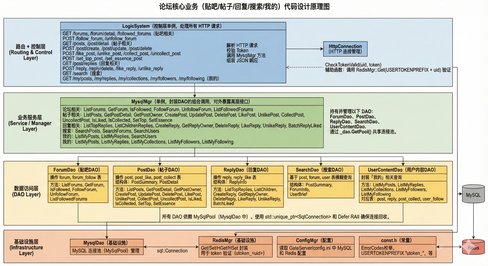
- 论坛 CRUD 视图：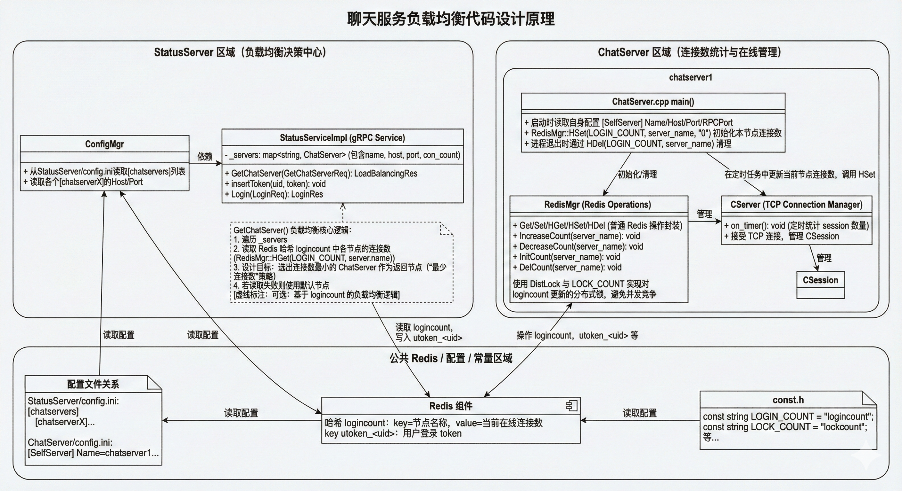
- 帖子流与计数：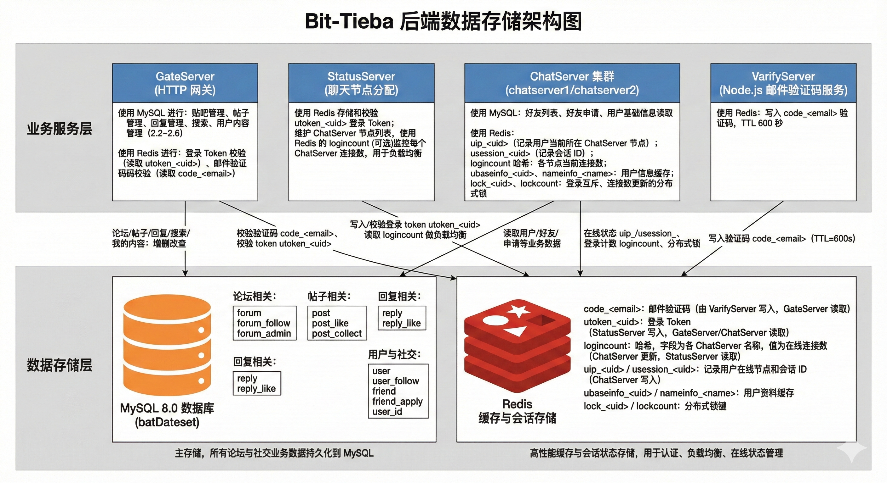
- 回复与楼中楼：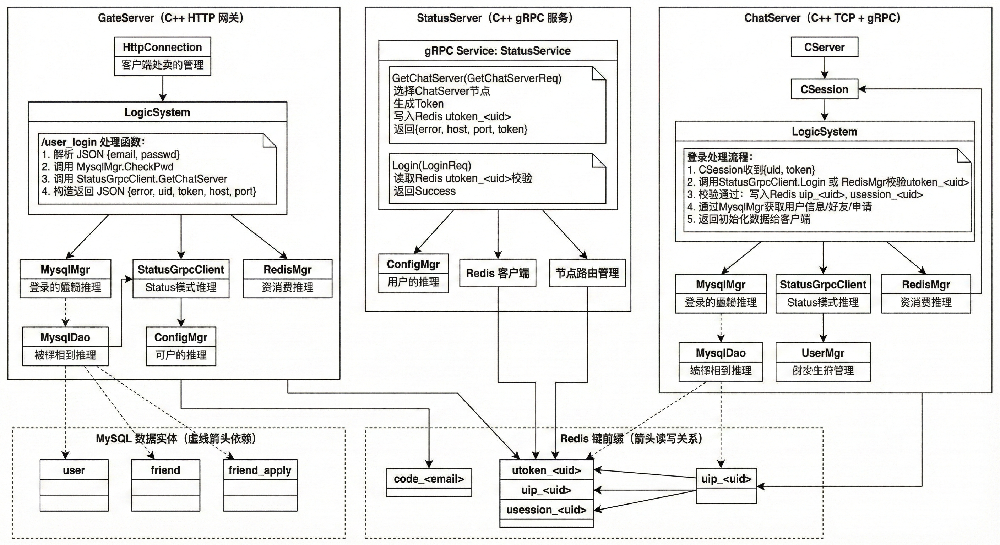
- 搜索与聚合：.png)
- 我的内容与权限：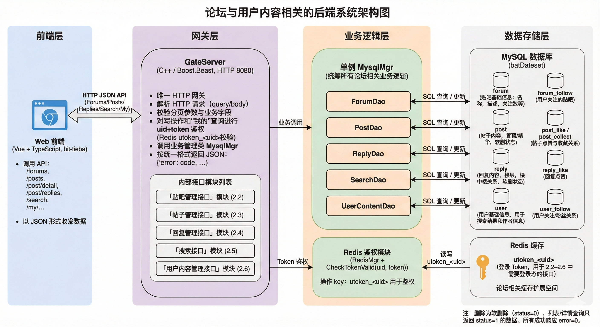
- 鉴权与 token：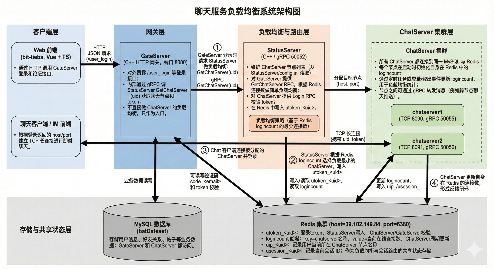
- ChatServer 节点通信：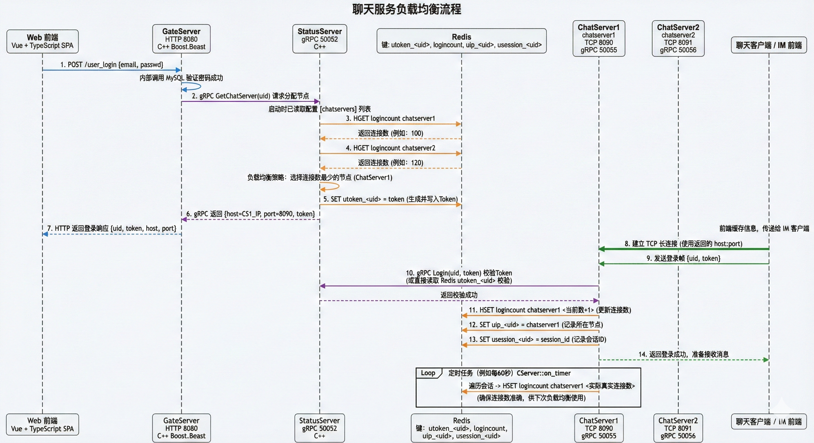
- 好友/申请流程：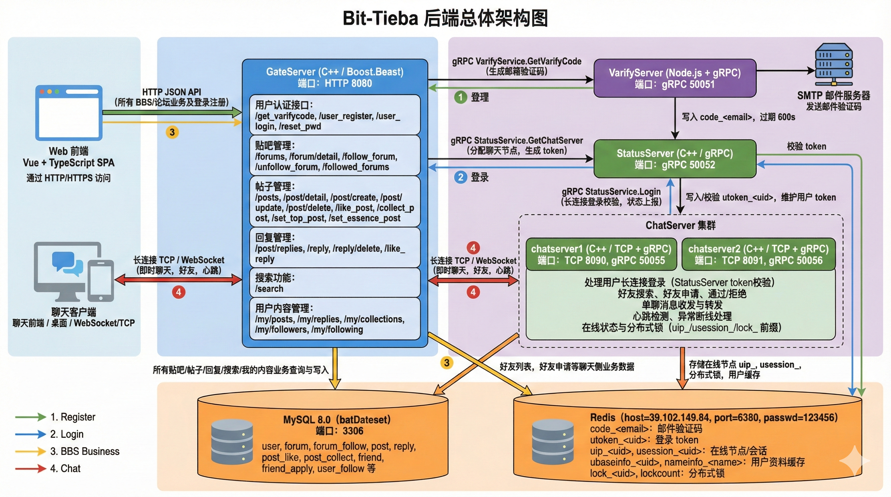
- 文本消息路由：.png)
- 部署与端口示意：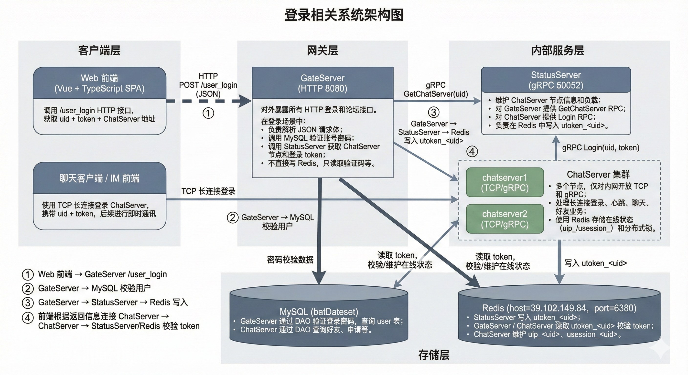
- 数据库关系示意：.png)
- 错误码与回调提示：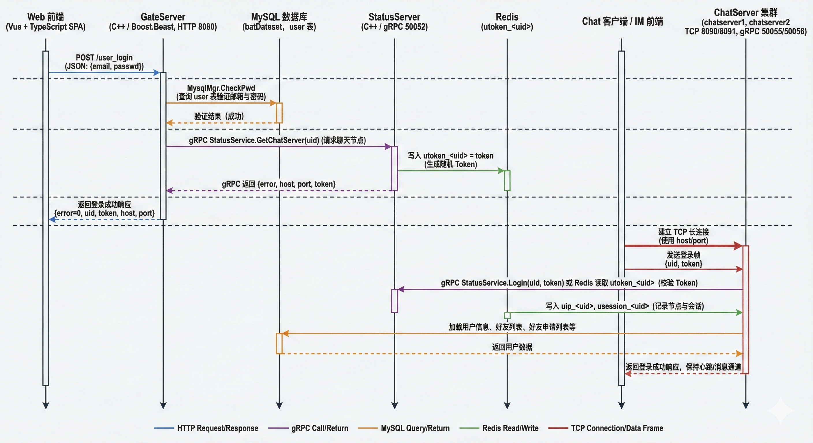
- 测试/运维关注：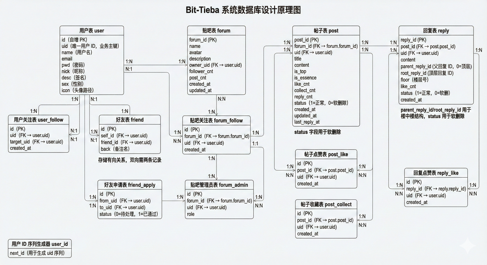
